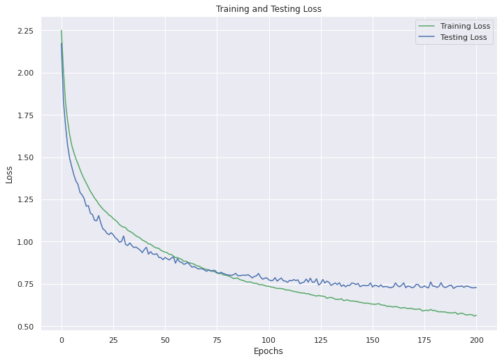
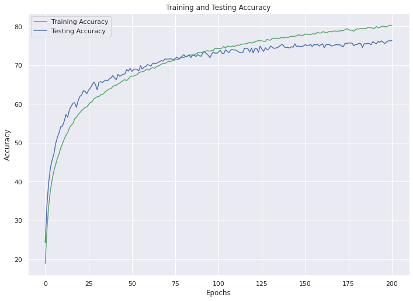
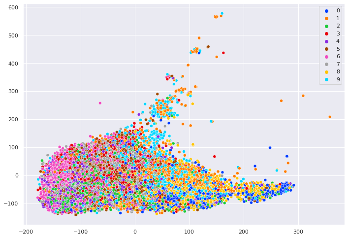

<!-- Google tag (gtag.js) -->

## Convolutional Neural Network(CNN) from Scratch

In this project, I implemented a three-layered convolutional neural network (CNN) (that was the constrained) architecture using a deep learning library (PyTorch). For the training and testing phases, I used CIFAR10 dataset.

For the full pipeline: 
### 1. Starting with a Base Model
I have started with a base model, which has three convolutional layers followed by max-pooling layers and there were 2 fully connected layers at the end. This model made me start with 63% accuracy in both training and testing. Then I tried to change the kernel sizes of these convolutional layers but it didn’t effected results that much. I decided to add Batch Normalization between the convolutional layers and activation functions. This resulted with improvement in training and testing accuracies.

Then I made data augmentation with ”Random Cropping” yet it decreased model’s performance. That’s probably because there were no overfitting, the model haven’t learn well yet. Improving generalization ended up with underfitting. Also, at this point, I have realized that adding max pooling layer after all of the convolutional layers may cause underfitting, too.

### 2. Trying Different Approaches

Since max-pooling layer undersamples it’s inputs, I decided to remove one of the max-pooling layers (let's call it Model 2). I had a much better result. I also wanted to add ”Random Vertical Flip” which ended up with again, bad results. So I removed it and also I have changed the first convolutional layer’s kernel size. Again, my model’s performance was not good enough. I tried to remove the second max-pooling layer too, and changed the second convolutional layer’s kernel size. Still, results were not better. So I decided to go back to my best models architecture (Model 2) but I also removed the second max-pooling layer and add a second fully connected layer. This brought me to my best model with the best results.

Adding one more fully connected layer probably prevented information loss. The dimension difference were high in between the input and output of the fully connected layers, when I was using 2 FC.

### 3. Results
I ran the model during 200 epochs and tried three different optimizers: Adam, RMSprop and SGD. I tried all of them and finally decided to use SGD since it performed the best. You can check the loss and accuracy graphs and the tsne plotting of the embeddings down below. Normally, I would expect tSNE plot to be more sparsed with the accuracy I got. It may be because my latent representation dimension was high (2704) or my tSNE function’s iteration parameter was not high enough.
 Epoch Accuracy:  80.13
 Epoch Loss:  0.56495221397456
 Epoch Test Accuracy:  76.33
 Epoch Test Loss:  0.7284866685320617
 

### 4. Provide a basis for further data collection through surveys or experiments

Sed ut perspiciatis unde omnis iste natus error sit voluptatem accusantium doloremque laudantium, totam rem aperiam, eaque ipsa quae ab illo inventore veritatis et quasi architecto beatae vitae dicta sunt explicabo. 

For more details see [GitHub Flavored Markdown](https://guides.github.com/features/mastering-markdown/).
