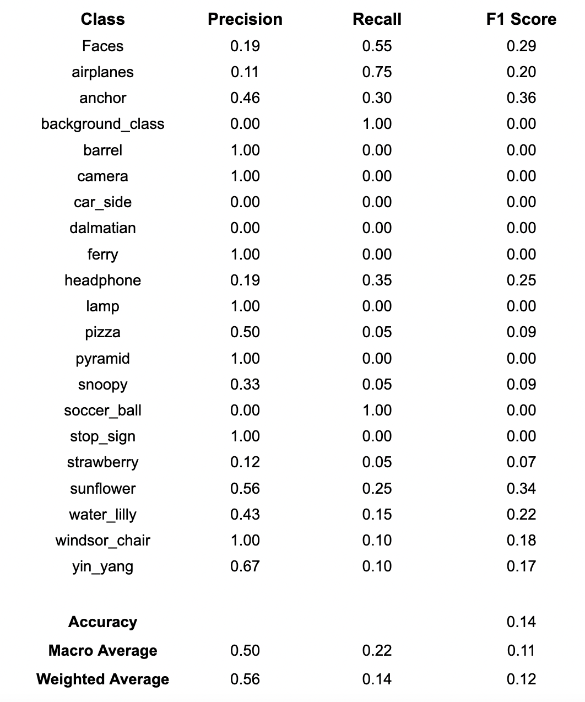
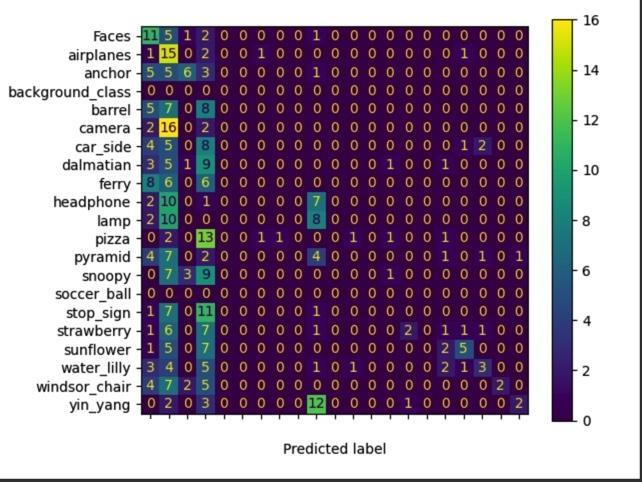
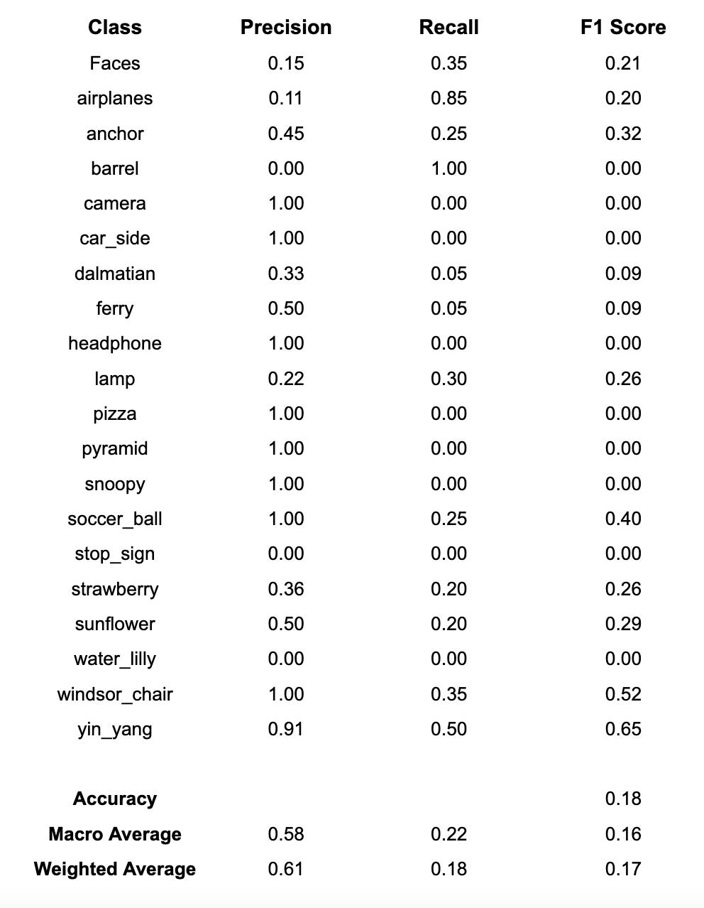
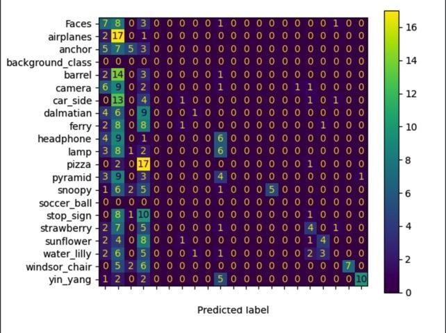
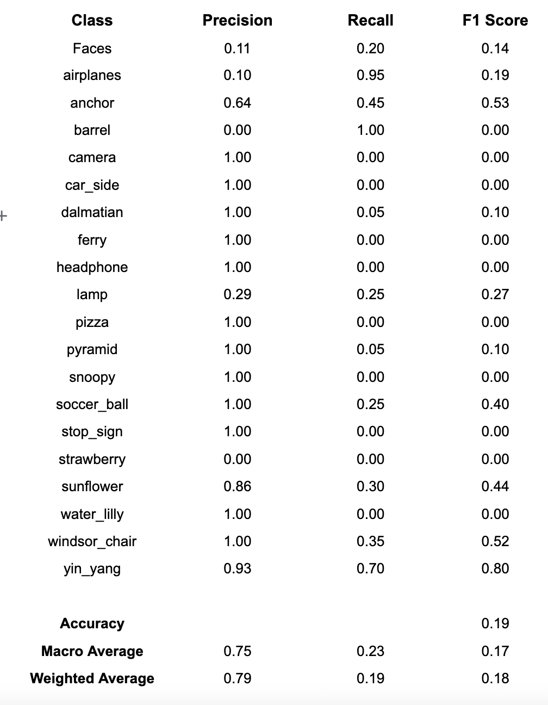
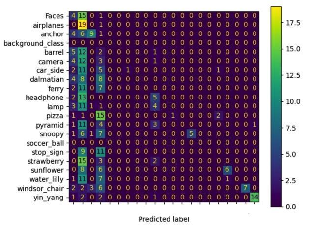

## Image Classification Using Traditional CV Methods

In this project, we worked as a group to classify a set of images using various methods. Each of us implemented different methods to achieve these goals. We, then, combined these methods to create full pipelines that predict image tags. For training and testing, we used The “Caltech20” dataset.

The pipeline consists of 4 steps: Feature Extraction, Finding Dictionary Centers, Feature Quantization and Classification. (In my pipeline, I used SIFT (OpenCV implementation), K-Means Algorithm (my implementation), Bag of Visual Words (my teammate's implementation) and Random Forest (Sklearn implementation) respectively.)
<br>
For the full pipeline: [](https://colab.research.google.com/drive/1q-qOlJVMTtxnwDGHX8TCQUZ7zYPww_Zk?usp=sharing)

### 1. Feature Extraction
I have used the OpenCV implementation of Scale-Invariant Feature Transform (SIFT) in my pipeline to extract the descriptors from the images. SIFT extracts different numbers of descriptors from each image, which are 128-dimensional feature vectors. I restricted the number of descriptors per image as 100, to lower the computational cost. It gives 1611904 descriptors from the Caltech20 training dataset, if I don’t restrict the number.

```javascript
#########IN THIS PART, I AM USING PREPROCESSING AND USING OPENCV SIFT IMPLEMENTATION TO EXTRACT THE DESCRIPTORS
def descriptor_Extractor(dirName,labels,descriptors):
    listOfFile = os.listdir(dirName)
    #listOfFile.sort()
    for entry in listOfFile:
        fullPath = os.path.join(dirName, entry)
        if descriptor_Extractor(fullPath,labels,descriptors)
        elif(not (fullPath.startswith("Caltech20/training/.") or fullPath.startswith("Caltech20/testing/."))):
            label = dirName.split("/")[2]
            img = cv2.imread(fullPath)
            #resizing images to decrease the computational cost
            img = cv2.resize(img,(150, 150))
            #convert images to grayscale
            img = cv2.cvtColor(img, cv2.COLOR_BGR2GRAY)
            #create SIFT object
            sift = cv2.xfeatures2d.SIFT_create(100)
            #detect SIFT features in both images
            keypoint, descriptor = sift.detectAndCompute(img, None)
            if (len(keypoint) >= 1): #to get rid of None's coming from sift keypoints
                descriptors.append(descriptor)
                labels.append(label)
```

### 2. Finding Dictionary Centers

To determine the codewords (dictionary centers), we needed a clustering algorithm. By processing all the descriptors and extracting some center values (vectors) from them, we create some benchmarks for our feature vectors. So I implemented the K-Means algorithm. It starts with random initial K centers and iteratively updates the center values, with the average values of cluster members. “Cluster membership” determined according to the euclidean distance. A data vector belongs to the cluster whose center is closest (minimum euclidean distance) to the data vector. For this problem, the important output of K-Means function is the list of centroids. We give the centers list to Mahmut’s Bag of Visual Words implementation, and this center values will be the vocabulary. Here, while determining the “K”, it’s important to understand its meaning. This number should at least be equal to the class number. But this is also not enough. Feature vectors should represent their class’ specific features if it’s possible to be distinguished from other class’ feature vectors. If we keep this number too low (i.e. 20), our feature vectors will be too generalized for being classified correctly and we can not expect a good accuracy from a classifier which we fed with these feature vectors. Yet, if we keep this number too high (i.e. 1000), our feature vectors will be too specific for being classified correctly. This situation would cause overfitting. Also, we should consider the computational cost. In the light of these constraints, we did our experiments with different number of K’s to see these effects on the results.
```javascript
##########THIS PART IS FOR CLUSTERING. MY OWN IMPLEMENTATION OF K-MEANS.
def cent(k,nr_el=128):
    centers=[]
    for i in range(k):
        centers.append(randint(0, 255, nr_el))
    return centers

def euclidian(p1,p2):
    return distance.euclidean(p1, p2)

def Kmeans(data,k,max_iterations):
    centers=cent(k,data.shape[1])
    for m in range(max_iterations):
        clusters = [[] for _ in range(k)]
        for i in range(len(data)):
            distances=[euclidian((data[i]),(center)) for center in centers]
            class_ind = distances.index(min(distances))
            clusters[class_ind].append(data[i])
        for j in range(len(clusters)):
            if(len(clusters[j])>0):
                centers[j] = [round(sum(element) / len(clusters[j])) for element in zip(*clusters[j])]
    return centers
```

### 3. Feature Quantization
!This part (Bag of Visual Words) was implemented by my teammate (Mahmut Karaca)!
Bag of Visual Words function simply generates a histogram using the image features and dictionary centers as input. Euclidean distance is used as the metric for calculating the nearest center.
```javascript
#####BAG OF VISUAL WORDS. THIS PART IS IMPLEMENTED BY MAHMUT KARACA#####
def get_histogram(image_features, centers):
    histogram = np.zeros(len(centers))
    for f in image_features:
        idx = np.argmin(list(map(lambda c: np.linalg.norm(f - c), centers)))
        histogram[idx] += 1
    return histogram
```
### 4. Classification
As a classifier, I decided to use Random Forest. Random Forest classifier consists of different Decision Trees. It classifies inputs by taking the average of the results of these decision trees or deciding on the dominant choice. Normally, with a quick research, you can see there are more examples which use SIFT with SVM than the ones which use with Random Forest. But there are some works [1][2] on comparison between the Random Forest and SVM, not only about accuracy but also about computation cost, which took my attention. I wanted to see the results with my experiments. That’s why I chose Random Forest.
### 5. Evaluation
I ran the pipeline for different number of clusters (K) which are 20,50,100. You can see the precision, recall, and F1-score results overall and per class.
<br>
K=20
<br>
<div style="text-align: center;">


</div>
<br>
K=50
<br>
<div style="text-align: center;">


</div>
<br>
K=100
<br>
<div style="text-align: center;">


</div>
<br>
### 6. References
[1]	A. Bosch, A. Zisserman and X. Munoz, "Image Classification using Random Forests and Ferns," 2007 IEEE 11th International Conference on Computer Vision, Rio de Janeiro, 2007, pp. 1-8, doi: 10.1109/ICCV.2007.4409066.
[2]	M. Sheykhmousa, M. Mahdianpari, H. Ghanbari, F. Mohammadimanesh, P. Ghamisi and S. Homayouni, "Support Vector Machine Versus Random Forest for Remote Sensing Image Classification: A Meta-Analysis and Systematic Review," in IEEE Journal of Selected Topics in Applied Earth Observations and Remote Sensing, vol. 13, pp. 6308-6325, 2020, doi: 10.1109/JSTARS.2020.3026724.
