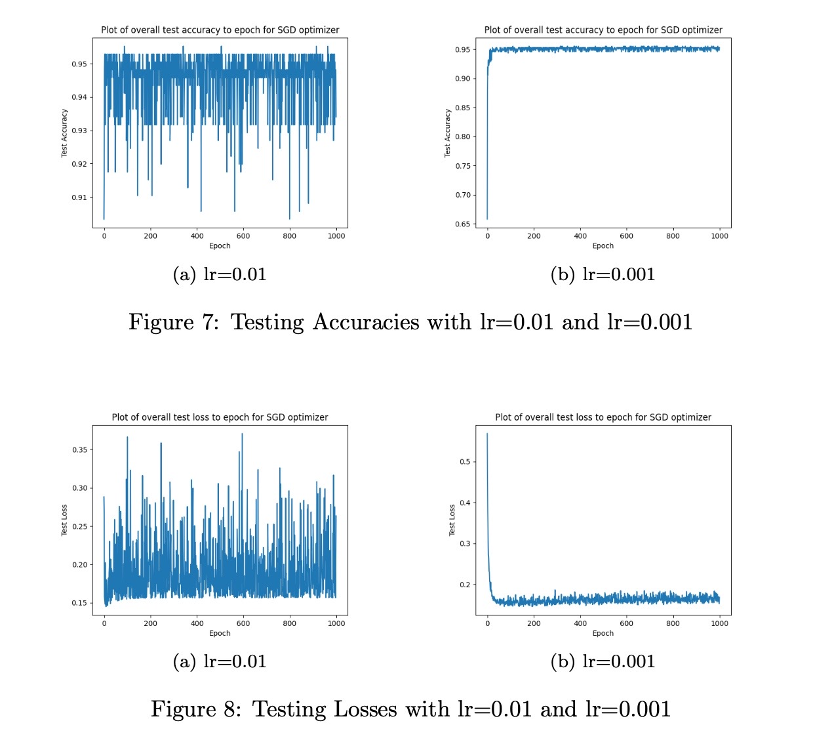

<!-- Google tag (gtag.js) -->

## Portfolio

---

### Pattern Recognition
[Expectation Maximization](/expectation_maximization)
 
In this project, I implemented Expectation Maximization algorithm as a solution to cluster a dataset which is a Gaussian Mixture model, includes three different Gaussian distribution.
 

---
[Logistic Regression and Gradient Descent from Scratch](/log_res)
 

 

---
[Project 3 Title](http://example.com/)

---

### Deep Learning

[MLP as a Neural Language Model](/mlp_language)
 
In this project, I implemented a neural language model using a multi-layer perceptron. This network receives 3 consecutive words as the input and predicts the next word.
 
- [Project 2 Title](http://example.com/)
- [Project 3 Title](http://example.com/)
- [Project 4 Title](http://example.com/)
- [Project 5 Title](http://example.com/)

---

---

Page template forked from <a href="https://github.com/evanca/quick-portfolio">evanca</a>

<!-- Remove above link if you don't want to attibute -->
