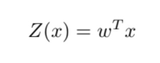
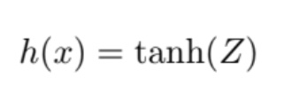
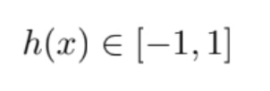
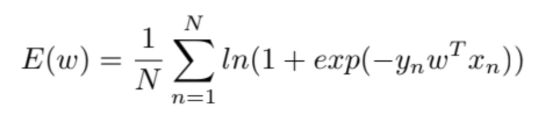
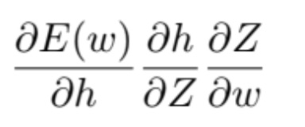
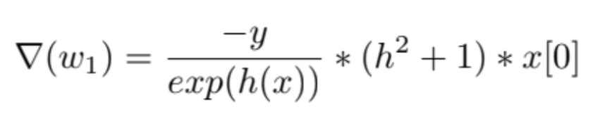
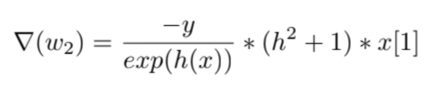
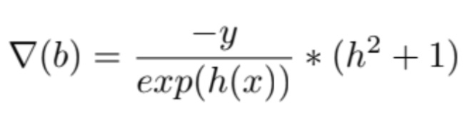
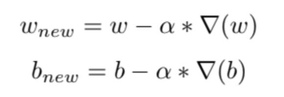
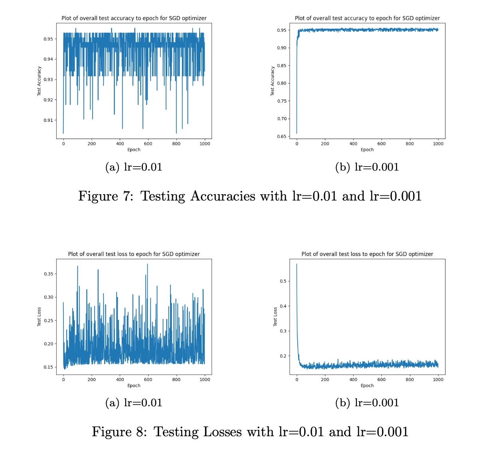

<!-- Google tag (gtag.js) -->

## Logistic Regression and Gradient Descent from Scratch
In this project, I implemented a logistic regression model from scratch and update its gradients by following stochastic gradient descent approach.

For the full pipeline: 
### Initialization

The dataset has 2 features. When I checked the training labels, I saw labels were either -1 or 1. So, I decided to use tanh as the scaler function, instead of the σ. So, in this problem: 

 and my loss function is (since I am using tanh, I choose this loss function. It gaves negative or zero into the logarithm if I use other popular logistic loss function):
 

### Training
For the training part, I started with random initialized weights w1, w2, b. For each epoch, i traversed in the shuffled dataset (I shuffled the indices of the dataset actually, not the dataset itself.) and in each iteration in the epoch, for each data point I randomly chose, I updated the weights. To take the partial derivative of the loss function and update the related weights (partial derivative of loss function according to w1 to update w1, etc.), I used chain rule.
 

for w1, the gradient is
 

for w2, the gradient is
 

and for b, gradient is
 

At the end of the each iteration, I updated the weights and the bias by the following formula:
 

Here, α is the learning rate. I tried my model with different learning rates. I have observed that, when I select learning rate high, the steps get bigger and more rapid changes can be observed from the accuracy graphs.

### Results
You can see the results of my model with epochs = [1000] and α=[0.01,0.001].
Overall (average) results of the model are:
--Training Accuracy : 0.769
--Epoch Training Loss: 0.081
--Test Accuracy : 0.95
--Epoch Test Loss: 0.165
 

