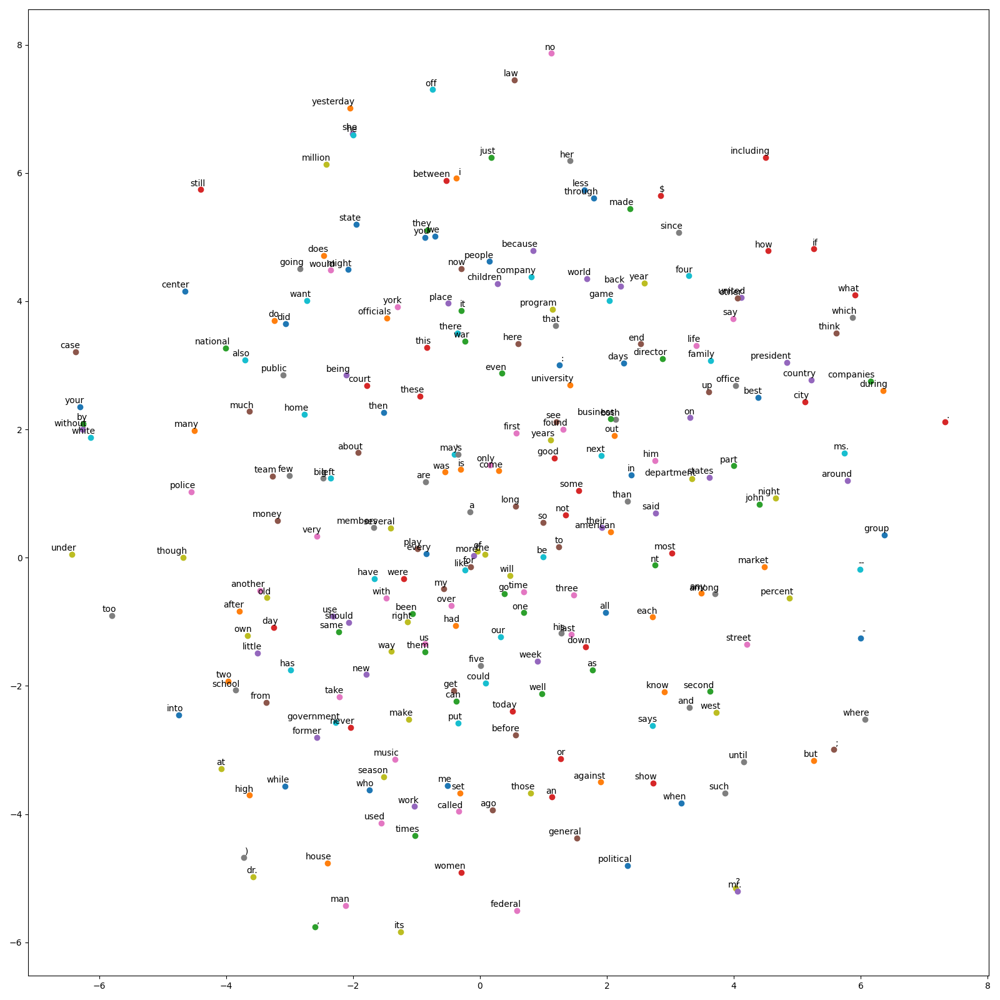

## MLP as a Neural Language Model
! In this project, I did not use any deep learning libraries such as Tensorflow, and Pytorch. I used Numpy and Matplotlib.
<br>
I trained a neural language model using a multi-layer perceptron. You can find the network scheme down below. The network consists of a 16 dimensional embedding layer, a 128 dimensional hidden layer and one output layer. The input is a sequence of 3 consecutive words. 
<br>

<br>
### 1. Network
Input is provided as integer valued indices representing a word in our 250-word dictionary. I converted each word to it's one-hot representation and passed it to the embedding layer (250x16). After the embedding layer, I concatenated three word embeddings and fed to the hidden layer. In the hidden layer, I tried two activation functions in different experiments: Sigmoid and ReLU. I used the softmax function over the 250 words as the output layer. 

I implemented "Network.py" where you can find the forward & backward propagation, and the activation functions.
```javascript
def relu(x):
    return x * (x > 0)
    
def deriv_relu(x):
    x[x<=0] = 0
    x[x>0] = 1
    return x
    
def sigmoid(z):
    return 1/(1 + np.exp(-z))

def deriv_sigmoid(z):
    return np.multiply(sigmoid(z),(1-sigmoid(z)))

def softmax(x):
    z = np.exp(x)
    sum = np.sum(z)
    softmax = z/sum
    return softmax

def stable_softmax(x):
    z=[i-max(i) for i in x]
    numerator = np.exp(z)
    denominator = np.sum(numerator)
    softmax = numerator / denominator
    return softmax

def cross_entropy(prediction,target):
    length = len(prediction)
    #soft_prediction = stable_softmax(prediction)
    soft_prediction = softmax(prediction)
    loss = -np.sum(np.multiply(target,np.log(soft_prediction)) + np.multiply((1 - target),np.log(1 - soft_prediction)) )/length
    return loss , soft_prediction
    
def deriv_loss(prediction,target):
    return np.subtract(prediction,target)


class Network(object):
    def __init__(self,onehot_dictionary,learning_rate):
        mean = 0
        standard_deviation = 1
        rows = 250
        columns = 16
        self.w1 = np.random.normal(mean, standard_deviation, (rows,columns))
        self.w2_1 = np.random.normal(mean, standard_deviation, (16, 128))
        self.w2_2 = np.random.normal(mean, standard_deviation, (16, 128))
        self.w2_3 = np.random.normal(mean, standard_deviation, (16, 128))
        self.w2 = np.concatenate((self.w2_1, self.w2_2, self.w2_3), axis=0)
        self.b1 = np.random.normal(mean, standard_deviation, 128)
        self.w3 = np.random.normal(mean, standard_deviation, (128,250))
        self.b2 = np.random.normal(mean, standard_deviation, 250)
        self.onehot_dictionary = onehot_dictionary
        self.learning_rate=learning_rate

    def save_weights(self,epoch_n):
        weightdict = {
            "w1": self.w1,
            "w2_1": self.w2_1,
            "w2_2": self.w2_2,
            "w2_3": self.w2_3,
            "w3": self.w3,
            "b1": self.b1,
            "b2": self.b2,
        }
        filename = "/content/gdrive/My Drive/Portfolio/MLP/"+"model{}.pk".format(epoch_n)
        file = open(filename, 'wb')
        pickle.dump(weightdict, file)

    def load_weights(self,filename):
        file = open(filename, 'rb')
        weightdict = pickle.load(file)
        self.w1 = weightdict["w1"]
        self.w2_1 = weightdict["w2_1"]
        self.w2_2 = weightdict["w2_2"]
        self.w2_3 = weightdict["w2_3"]
        self.w2 = np.concatenate((self.w2_1, self.w2_2, self.w2_3), axis=0)
        self.b1 = weightdict["b1"]
        self.w3 = weightdict["w3"]
        self.b2 = weightdict["b2"]

    def forward(self, batch, label):
        batch_losses=[]
        self.word1 = np.array([self.onehot_dictionary[batch[i][0]] for i in range(len(batch))]) #(64, 250)
        self.word2 = np.array([self.onehot_dictionary[batch[i][1]] for i in range(len(batch))]) #(64, 250)
        self.word3 = np.array([self.onehot_dictionary[batch[i][2]] for i in range(len(batch))]) #(64, 250)
        e1 = np.matmul(self.word1, self.w1) #w1.shape=(250, 16)
        e2 = np.matmul(self.word2, self.w1)
        e3 = np.matmul(self.word3, self.w1) #e3.shape=(64,16)
        self.e = np.concatenate((e1, e2, e3),axis=1) #e.shape=(64,48)
        self.h = np.matmul(self.e, self.w2) + self.b1 #w2.shape=(48, 128) h.shape= (64, 128)
        #self.h_activated = sigmoid(self.h) #h_activated.shape=(64, 128)
        self.h_activated = relu(self.h) #h_activated.shape=(64, 128)
        self.output = np.matmul(self.h_activated, self.w3) + self.b2 #output.shape=(64, 250)
        self.targets=np.array([self.onehot_dictionary[label[i]] for i in range(len(label))])
        loss,preds = cross_entropy(self.output,self.targets)
        print("\r LOSS in the network:",loss)
        batch_losses.append(loss)
        return sum(batch_losses)/len(batch_losses),preds

    def update_w1(self,common_w1_w2):
        #a=np.matmul(common_w1_w2,self.w2_1.T) #64X16
        w1_gradient_1 = np.matmul(self.word1.T,np.matmul(common_w1_w2,self.w2_1.T))
        w1_gradient_2 = np.matmul(self.word2.T,np.matmul(common_w1_w2,self.w2_2.T))
        w1_gradient_3 = np.matmul(self.word3.T,np.matmul(common_w1_w2,self.w2_3.T))
        w1_gradient= np.add(w1_gradient_1,w1_gradient_2,w1_gradient_3)
        self.w1=np.subtract(self.w1,np.multiply(w1_gradient,self.learning_rate))


    def update_w2(self,common_w1_w2):
        w2_gradient_total = np.matmul(self.e.T,common_w1_w2)
        w2_1_gradient = np.split(w2_gradient_total,3)[0]
        w2_2_gradient = np.split(w2_gradient_total,3)[1]
        w2_3_gradient = np.split(w2_gradient_total,3)[2]
        print("W21 gradient in the network:",w2_1_gradient)
        print("W22 gradient in the network:",w2_2_gradient)
        print("W23 gradient in the network:",w2_3_gradient)
        self.w2_1 = np.subtract(self.w2_1, np.multiply(w2_1_gradient, self.learning_rate))
        self.w2_2 = np.subtract(self.w2_2, np.multiply(w2_2_gradient, self.learning_rate))
        self.w2_3 = np.subtract(self.w2_3, np.multiply(w2_3_gradient, self.learning_rate))
        self.w2 = np.concatenate((self.w2_1, self.w2_2, self.w2_3), axis=0)

    def update_b1(self,common_w1_w2):
        b1_gradient = np.mean(common_w1_w2,axis=0)
        self.b1 = np.subtract(self.b1, np.multiply(b1_gradient, self.learning_rate))

    def update_w3(self):
        w3_gradient = np.matmul(self.h_activated.T,self.dLossdOutput)
        self.w3 = np.subtract(self.w3, np.multiply(w3_gradient, self.learning_rate))

    def update_b2(self):
        b2_gradient = np.mean(self.dLossdOutput,axis=0)
        self.b2 = np.subtract(self.b2, np.multiply(b2_gradient, self.learning_rate))

    def backward(self):
        self.dLossdOutput=deriv_loss(self.output,self.targets) #shape=64x250
        #self.dSigmoid=deriv_sigmoid(self.h) #shape=64x128
        self.dRelu=deriv_relu(self.h)
        #common_w1_w2=np.multiply(np.matmul(self.dLossdOutput,self.w3.T),self.dSigmoid) #shape=64x128
        common_w1_w2=np.multiply(np.matmul(self.dLossdOutput,self.w3.T),self.dRelu) #shape=64x128
        self.update_w1(common_w1_w2)
        self.update_w2(common_w1_w2)
        self.update_b1(common_w1_w2)
        self.update_w3()
        self.update_b2()
```

### 2. Pipeline
In the a main function, main.py, I load the dataset, shuffle the training data and divide it into mini-batches. I train the model and evaluate the model performance on the validation set.
<br>For the full pipeline: [](https://colab.research.google.com/drive/1cGu0hQV7VCacA_hB8RMrfe5i83WBRHys?usp=sharing)

### 3. Evaluation
In eval.py, I load the network weights and evaluate the model on test data. After obtaining 16 dimensional embeddings, I created a 2-D plot of the embeddings using t-SNE.
```javascript
def eval(network,arr,labels,batch_size,filename):
    total_size = len(arr)
    indices = np.arange(total_size)
    epoch_loss = []
    correct = 0
    network.load_weights(filename)
    for start_index in range(0, total_size, batch_size):
        end_index = total_size if start_index + batch_size > total_size else start_index + batch_size
        batch_input = [arr[i] for i in indices[start_index:end_index]]
        batch_label = [labels[i] for i in indices[start_index:end_index]]
        batch_loss, predictions = network.forward(batch_input, batch_label)
        epoch_loss.append(batch_loss)
        preds = np.argmax(predictions, axis=1)
        correct += np.sum(preds == batch_label)
    loss = sum(epoch_loss) / len(epoch_loss)
    acc = 100*correct / total_size
    return loss,acc
```
<br>

<br>
```javascript
def tsne_plot(filename,word_dictionary,one_hot_dictionary):
    labels = []
    embeddings = []
    file = open(filename, 'rb')
    weightdict = pickle.load(file)
    w1 = weightdict["w1"]

    for keys in one_hot_dictionary:
        embedding = np.matmul(one_hot_dictionary[keys],w1)
        embeddings.append(embedding)
        labels.append(word_dictionary[keys])

    tsne_model = TSNE(perplexity=40, n_components=2, init='pca', n_iter=2500, random_state=23)
    new_values = tsne_model.fit_transform(embeddings)

    x = []
    y = []
    for value in new_values:
        x.append(value[0])
        y.append(value[1])

    plt.figure(figsize=(16, 16))
    for i in range(len(x)):
        plt.scatter(x[i], y[i])
        plt.annotate(labels[i],
                     xy=(x[i], y[i]),
                     xytext=(5, 2),
                     textcoords='offset points',
                     ha='right',
                     va='bottom')
    plt.show()
```

### 4. Additional Notes & References
<br>
Softmax have been implemented in the loss function and the derivative of the loss function and softmax have been calculated together. Stable softmax have been used to get rid of the softmax underflow and overflow.
<br>
Stanford University CS231n lecture resource [1], ”Deep Learning” book [2] and some additional websites [3], [4] have been used during this study. For plotting the tSNE graph, a ready-to-go code has been used [5].
<br>
<br>[1] “CS231n: Convolutional Neural Networks for Visual Recognition”, https://cs231n.github.io/optimization-2/#mat.
<br>[2] Goodfellow, I., Y. Bengio and A. Courville, Deep Learning, MIT Press, 2016, http://www.deeplearningbook.org.
<br>[3] “Classification and Loss Evaluation - Softmax and Cross Entropy Loss”, https://deepnotes.io/softmax-crossentropy.
<br>[4] “A Gentle Introduction to Cross-Entropy Loss Function”, https://sefiks.com/2017/12/17/
a-gentle-introduction-to-cross-entropy-loss-function/.
<br>[5] “Visualizing Word Vectors with t-SNE”, https://www.kaggle.com/jeffd23/visualizing-word-vectors-with-t-sne.
